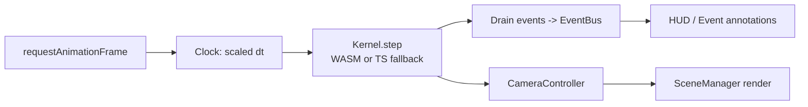

# Contributing

This guide covers how to develop, debug, and verify changes to the Star System Simulation.
For a project overview and first-run setup, see [`README.md`](./README.md).

## Prerequisites

- **[Node.js](https://nodejs.org/)** 18+ (developed on Node 22).
- **[Rust](https://www.rust-lang.org/tools/install)** stable toolchain, with the
  `wasm32-unknown-unknown` target (installed automatically by `wasm-pack`).
- **[wasm-pack](https://rustwasm.github.io/wasm-pack/installer/)** for building the WASM
  kernel.
- **[clippy](https://github.com/rust-lang/rust-clippy)** and **rustfmt** components (ship
  with a standard `rustup` install): `rustup component add clippy rustfmt`.

## Local development

1. Install dependencies once: `npm install`.
2. Build the WASM kernel: `npm run wasm:build`.
3. Start the dev server: `npm run dev` and open the printed URL (default
   `http://localhost:5173`).

Vite provides hot-module reload for the TypeScript/GLSL/CSS layers, so most edits under
`./src/` appear instantly. **Rust changes are not hot-reloaded** — after editing anything in
`./wasm/src/`, re-run `npm run wasm:build` and refresh the browser.

### Architecture at a glance

The per-frame data flow (assembled in `./src/app/`) is:



Key boundaries:

- **`./src/sim/PhysicsKernel.ts`** — the kernel contract. Both `./src/sim/WasmKernel.ts`
  (Rust/WASM) and `./src/sim/TsFallbackKernel.ts` (pure TS) implement it and expose state as
  flat typed-array buffers. `WasmKernel` feature-detects WASM and falls back automatically.
- **`./src/config/fateModel.ts`** — the single source of truth for the death path
  (white dwarf / neutron star / pulsar). Change lifecycle thresholds here.
- **`./src/sim/stages.ts`** — the deterministic lifecycle FSM; emits exactly one event per
  transition.
- **`./src/i18n/`** — all display strings. Never hard-code user-facing text.

## Debugging

### Front-end / rendering

- Use the browser **DevTools console** for runtime errors and the **Performance** tab for
  frame timing.
- To confirm which kernel is active, watch the console on startup — `WasmKernel` logs when it
  falls back to the TS kernel. You can force-test the fallback by temporarily renaming
  `./wasm/pkg/` so the WASM import fails.
- GLSL shader issues surface as WebGL warnings in the console; shaders live under
  `./src/render/shaders/`.
- The setup form's **"show information about star system events"** checkbox enables the
  annotation overlay (`./src/ui/EventAnnotations.ts`) — useful for confirming event
  emission timing without reading the console.

### Physics kernel (Rust)

- Run kernel logic in isolation with `cargo test` (see below) rather than through the
  browser — it is far faster to iterate on.
- The TS fallback kernel and the WASM kernel are kept in parity by a deterministic
  small-scenario test (`./test/sim/WasmKernel.test.ts`); run it after any kernel change.

## Verification

Run the full matrix before opening a PR. All commands must pass.

### TypeScript / front-end

```bash
npm run typecheck      # tsc --noEmit (strict)
npm run lint           # ESLint, fails on any warning
npm run format:check   # Prettier (use `npm run format` to auto-fix)
npm test               # Vitest unit tests
npm run build          # wasm:build + vite build
```

### Rust / WASM (run inside ./wasm)

```bash
cargo fmt --check
cargo clippy -- -D warnings
cargo test
```

## Testing conventions

- Unit tests live under `./test/`, mirroring the `./src/` layout, and use
  **[Vitest](https://vitest.dev/)**.
- Implement code and its tests **together** in the same change — tests are not a separate
  task.
- Prefer testing pure logic (fate model, clock mapping, stage transitions, camera/body math,
  i18n completeness, buffer-layout invariants). Rendering itself is validated visually.
- Rust logic is tested with `#[cfg(test)]` modules via `cargo test`.

To run a single Vitest file while iterating:

```bash
npx vitest run test/sim/stages.test.ts
# or watch mode:
npx vitest test/sim/stages.test.ts
```

## Adding a new language

Localization is data-only:

1. Add a new catalog file under `./src/i18n/` (e.g. `sv.json`) with **the same keys** as
   `./src/i18n/en.json`.
2. Register it in `./src/i18n/i18n.ts` and add the option to the language selector in
   `./src/ui/SetupForm.ts`.
3. The i18n key-parity test enforces that every catalog has an identical key set — run
   `npm test` to confirm.

## Coding standards

- **TypeScript strict mode** — no `any` escapes; keep `npm run typecheck` clean.
- **ESLint + Prettier** — run `npm run format` before committing; lint must pass with zero
  warnings.
- **No hard-coded user-facing strings** — route everything through i18n.
- Keep the `PhysicsKernel` contract stable: if you change buffer layout, update **both**
  kernel implementations and their parity tests.

## Commit / PR checklist

- [ ] `npm run typecheck` passes
- [ ] `npm run lint` passes
- [ ] `npm run format:check` passes
- [ ] `npm test` passes
- [ ] `cargo fmt --check`, `cargo clippy -- -D warnings`, `cargo test` pass (in `./wasm`)
- [ ] `npm run build` succeeds
- [ ] New/changed behavior has accompanying tests
