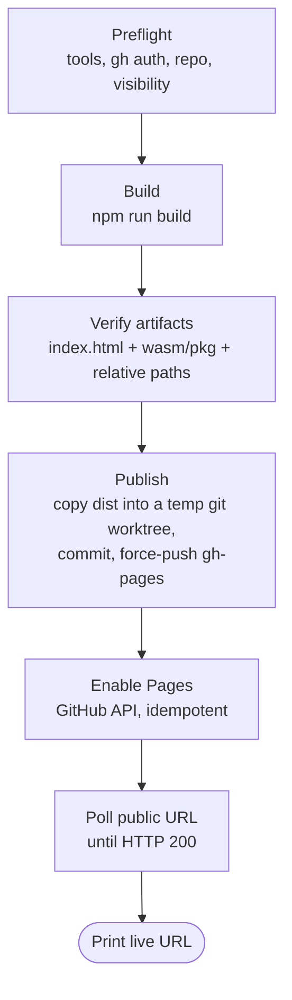

# Deployment

The simulation is a **fully static, client-side bundle** — HTML, JavaScript, CSS and the
Rust kernel compiled to WebAssembly. There is no server component, no API and no
database, so it can be published on any static host.

**Live site:** <https://amoilanen.github.io/star-system-simulation/>

One command builds and publishes it:

```bash
python3 scripts/deploy.py
```

---

## What gets deployed

`npm run build` produces `./dist/`, which is what gets published:

```text
dist/
  index.html                      # entry page, references assets relatively
  assets/
    index-<hash>.js               # app bundle (Three.js, UI, TS kernel fallback)
    index-<hash>.css              # styles
    star_kernel-<hash>.js         # bundled kernel glue
  wasm/pkg/
    star_kernel.js                # wasm-pack glue, loaded at runtime
    star_kernel_bg.wasm           # the Rust physics kernel
  .nojekyll                       # added by the deploy script (see below)
```

Two build details make the bundle host-portable — both matter if you deploy somewhere
other than GitHub Pages:

- **Relative asset URLs.** `vite.config.ts` sets `base: './'`, so the bundle works whether
  it is served from a domain root (`https://example.com/`) or a sub-path
  (`https://user.github.io/star-system-simulation/`).
- **The WASM kernel is copied into the build.** `./src/sim/WasmKernel.ts` imports the
  `wasm-pack` output through a _computed_ specifier so neither `tsc` nor the bundler
  hard-depends on a generated artifact. That also means Rollup never sees it, so the
  `copy-wasm-package` plugin in `./vite.config.ts` copies `wasm/pkg/` into `dist/wasm/pkg/`,
  and the kernel URL is resolved against `document.baseURI` at runtime. Without this the
  site still runs, but silently falls back to the slower pure-TypeScript kernel.

## Prerequisites

| Tool                  | Needed for                                            | Install                                         |
| --------------------- | ----------------------------------------------------- | ----------------------------------------------- |
| **Python 3.8+**       | running `./scripts/deploy.py` (standard library only) | <https://www.python.org/>                       |
| **Node.js 18+**       | building the bundle                                   | <https://nodejs.org/>                           |
| **Rust + wasm-pack**  | compiling the physics kernel                          | `cargo install wasm-pack`                       |
| **git**               | pushing the built site                                | <https://git-scm.com/>                          |
| **GitHub CLI (`gh`)** | repository lookup + enabling Pages                    | <https://cli.github.com/>, then `gh auth login` |

The GitHub token needs the **`repo`** scope. The repository should be **public** —
GitHub Pages on a private repository requires a paid plan; the script warns if it is not.

## Usage

```bash
# Full run: preflight → build → publish → enable Pages → wait until live
python3 scripts/deploy.py

# See exactly what would happen, without building, pushing or changing settings
python3 scripts/deploy.py --dry-run

# Re-publish the existing ./dist/ (skips the ~30 s Rust + Vite build)
python3 scripts/deploy.py --skip-build

# Deploy someone else's fork, to a different branch, and open it when done
python3 scripts/deploy.py --repo someone/star-sim --branch pages --open
```

### Options

- **`--repo owner/name`**: Target repository. Defaults to the GitHub remote of this clone.
- **`--branch <name>`**: Branch the built site is pushed to. Default `gh-pages`.
- **`--message <text>`**: Commit message for the published site.
- **`--skip-build`**: Publish the existing `./dist/` instead of rebuilding.
- **`--no-wait`**: Return immediately instead of polling the public URL.
- **`--timeout <seconds>`**: How long to wait for the site to answer. Default `300`.
- **`--open`**: Open the deployed site in a browser when finished.
- **`--dry-run`**: Print the plan; run only read-only commands.

Exit code is `0` on success and `1` on failure, so the script can be used in CI.

## How it works



1. **Preflight** — checks that `git`, `gh`, `npm` and `wasm-pack` are present, that `gh` is
   authenticated, resolves the repository, and warns about a private repository or an
   uncommitted working tree (whose contents _would_ end up in the build).
2. **Build** — installs dependencies if `node_modules/` is missing, then runs
   `npm run build` (which is `wasm-pack build` followed by `vite build`).
3. **Verify artifacts** — refuses to publish an incomplete bundle: `index.html`, the
   `wasm/pkg/` kernel files and relative asset paths must all be present. This is what
   stops a broken or WASM-less build from reaching production.
4. **Publish** — checks the branch out into a **temporary git worktree**, replaces its
   contents with `dist/`, adds `.nojekyll` (GitHub Pages otherwise runs Jekyll, which
   ignores paths beginning with `_`), commits and force-pushes. Using a worktree means
   your checkout, index and current branch are never touched. If `gh-pages` does not exist
   yet it is created as an orphan branch, so the site history stays separate from the
   source history.
5. **Enable Pages** — `GET /repos/{owner}/{repo}/pages`; creates the site with `POST` if it
   does not exist, or repoints it with `PUT` if it serves a different branch. Idempotent,
   so repeat deployments are no-ops here.
6. **Wait** — polls the public URL every 5 s until it returns `200`. A _first_ deployment
   typically needs 30–60 s; later ones are usually live in seconds.

## Deploying somewhere else

`./dist/` is self-contained, so any static host works. Build first
(`npm run build`), then upload the directory:

- **Netlify** — `npx netlify-cli deploy --dir=dist --prod`, or drag `dist/` onto
  <https://app.netlify.com/drop>.
- **Vercel** — `npx vercel deploy dist --prod`.
- **Cloudflare Pages** — `npx wrangler pages deploy dist`.
- **Surge** — `npx surge dist`.
- **Any web server / S3 bucket** — copy `dist/` as-is; no rewrite rules are needed since
  the app is a single page with no client-side routing.

Serve `.wasm` files with the `application/wasm` content type where the host does not do it
automatically — otherwise the app quietly falls back to the TypeScript kernel.

## Troubleshooting

- **`gh` is not authenticated** — run `gh auth login` and pick a token with the `repo`
  scope.
- **`Could not enable GitHub Pages (HTTP 403)`** — the token lacks permission. Enable it
  manually once under _Settings → Pages_ (source: branch `gh-pages`, folder `/`); later
  runs of the script then just push.
- **Site returns 404 for several minutes** — normal for a first deployment while GitHub
  provisions the site. Re-run with `--skip-build --no-wait` if you would rather not wait,
  and check the URL later.
- **Old version still showing** — a browser or CDN cache. Hard-reload
  (<kbd>Ctrl/Cmd</kbd>+<kbd>Shift</kbd>+<kbd>R</kbd>); asset filenames are content-hashed, so
  only `index.html` can be stale.
- **The simulation runs but feels slow** — the WASM kernel probably failed to load and the
  TypeScript fallback took over. Open DevTools → Network and check that
  `wasm/pkg/star_kernel_bg.wasm` is fetched with status 200; if it is missing from the
  deployment, `npm run build` was run without Rust/`wasm-pack` available.
- **`The build output is incomplete`** — install Rust and `wasm-pack`, then rebuild;
  `npm run build` cannot produce the kernel without them.

## Rollback

Every deployment is a commit on `gh-pages`, so rolling back is a push:

```bash
git fetch origin gh-pages
git push --force origin <previous-commit-sha>:gh-pages
```
